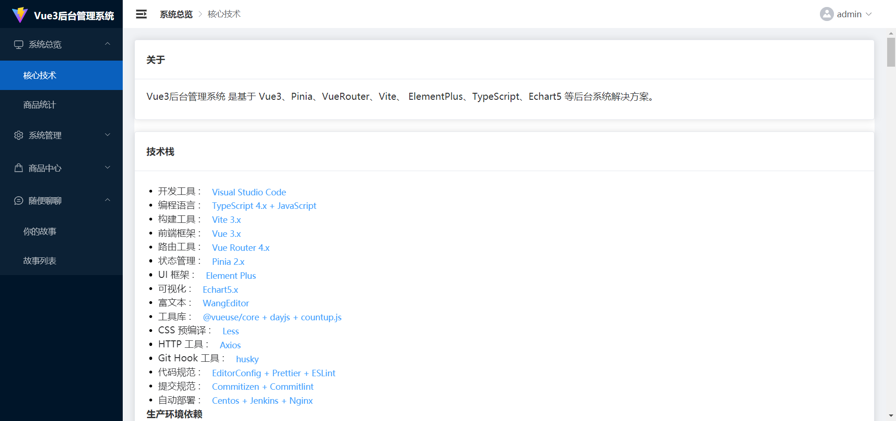
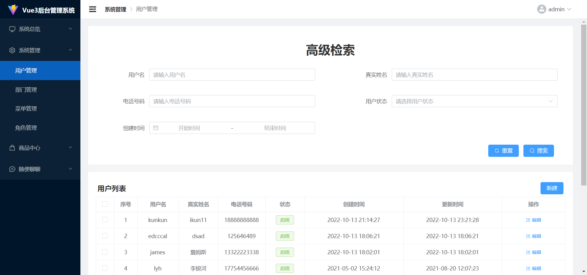
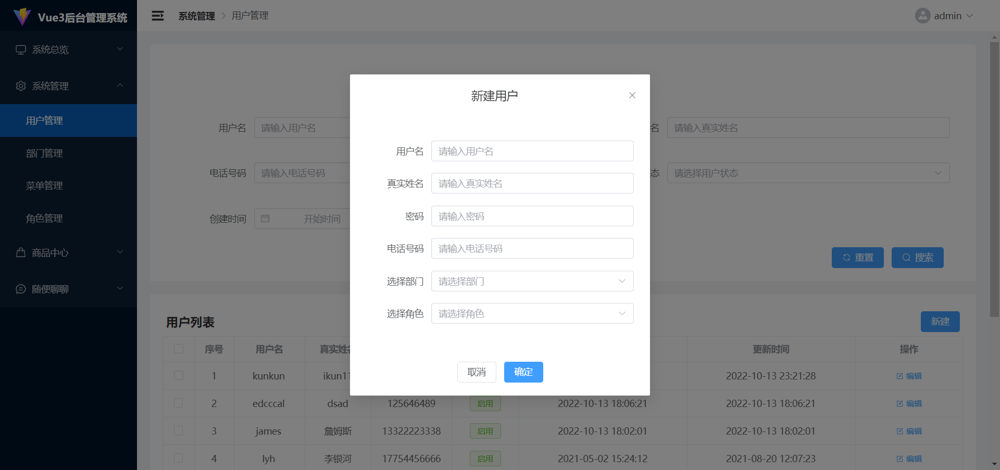
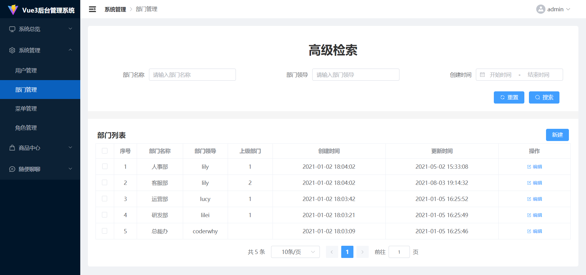
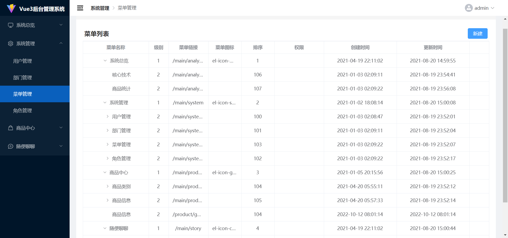
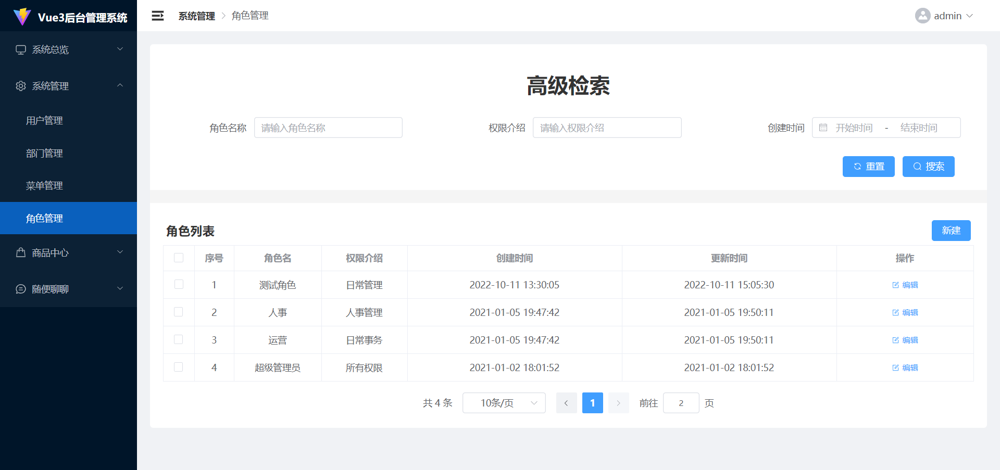
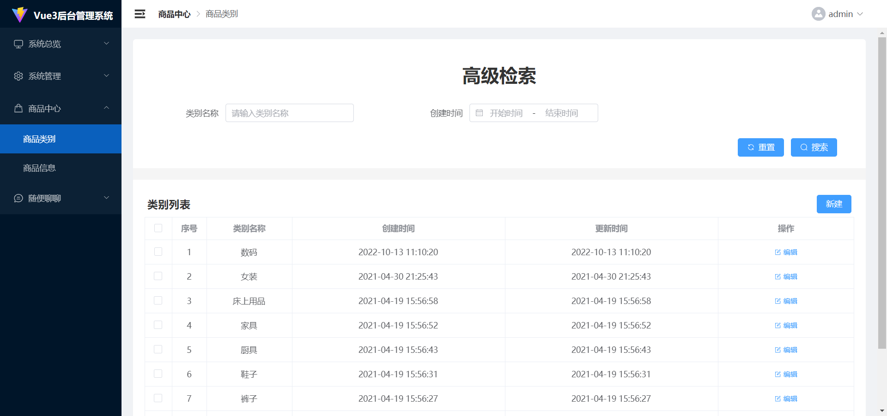
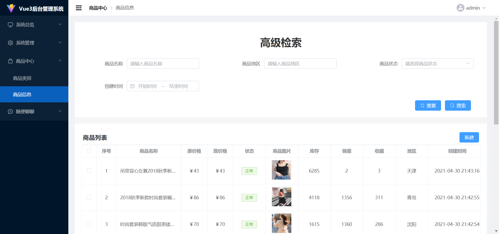

# Vu3 后台管理系统

Vue3 后台管理系统 是基于 Vue3、Pinia、VueRouter、Vite、 ElementPlus、TypeScript、Echart5 等后台系统解决方案。

## 介绍

本项目为后台管理系统 Demo 项目，接口来源于网络，具有用户管理、部门管理、菜单管理、角色管理、 商品类别、商品信息等管理页面

### 项目图片

- 项目介绍页面

  

- 商品统计页面

  

- 系统管理页面

  - 用户管理：
    
    
  - 部门管理：
    
  - 菜单管理：
    
  - 角色管理：
    

- 商品管理页面

  - 商品类别：
    
  - 商品信息：
    

### 项目技术栈

- 开发工具 : Visual Studio Code
- 编程语言 : TypeScript 4.x + JavaScript
- 构建工具 : Vite 3.x
- 前端框架 : Vue 3.x
- 路由工具 : Vue Router 4.x
- 状态管理 : Pinia 2.x
- UI 框架 : Element Plus
- 可视化 : Echart5.x
- 工具库 : @vueuse/core + dayjs + countup.js
- CSS 预编译 : Less
- HTTP 工具 : Axios
- Git Hook 工具 : husky
- 代码规范 : EditorConfig + Prettier + ESLint
- 提交规范 : Commitizen + Commitlint

## 运行项目

### 安装依赖

```sh
npm install
```

### 启动项目

```sh
npm run dev
```

### 打包项目

```sh
npm run build
```

## 项目规范

|                       |                                                                         |
| --------------------- | ----------------------------------------------------------------------- |
| 组件的文件            | 统一小写, 多个单词使用-分割                                             |
| 组件的目录结构        | 例如 button 组件：button/src/index.vue, 统一在 button/index.ts 导出     |
| 组件导包顺序          | 导 vue 技术栈的包 , 导第三方的工具函数 , 导本地的组件, 导本地的工具函数 |
| 组件的名称            | 统一大写开头，驼峰命名                                                  |
| 组件属性顺序          | name, components, props, emits, setup ...                               |
| template 标签         | 小写加 - ( 例如：&lt;case-panel/&gt; )                                  |
| template 标签属性顺序 | v-if , v-for , ref, class, style, ... ,事件                             |
| 组件的 props          | 小写开头，驼峰命名，必须编写类型默认值                                  |
| 组件的样式            | 作用域：scoped, lang = scss / less ; 类名：统一小写, 多个单词使用-分割  |

## Git 提交规范

|             |                |
| ----------- | -------------- |
| add 操作    | git add        |
| commit 操作 | npm run commit |
| pull 操作   | git pull       |
| push 操作   | git push       |
